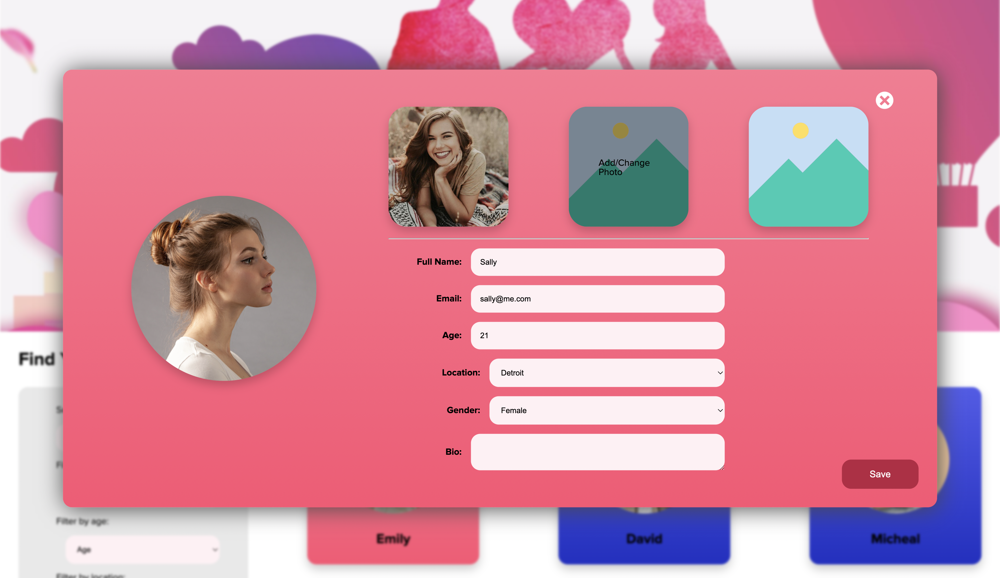
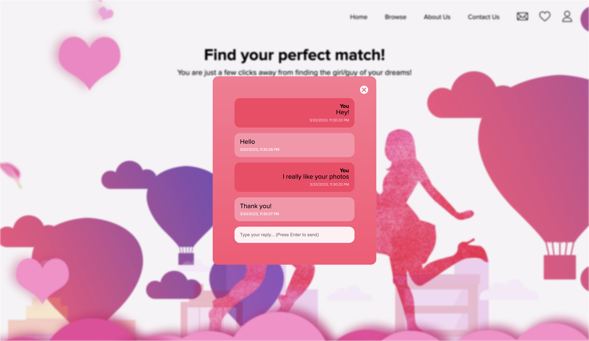

# Dating Website
This is a small full-stack project, where I implemented a dating website. The website allows the user to singup/login, search for users, follow or block users and message them.

### Languages Used
Laravel for backend, HTML, CSS and JS for frontend.

### Screenshots

### Date
21 March 2023

### Author
Ayman Hajjar